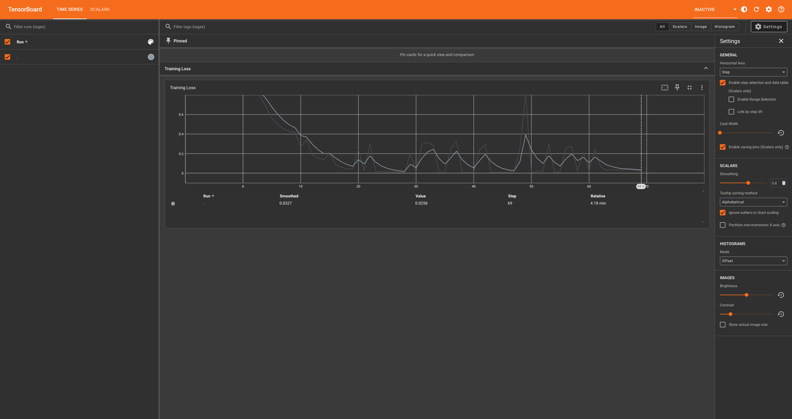

# PEFT Model Training with PyTorch and Hugging Face Transformers

This project provides a script for training a Parameter-Efficient Fine-Tuning (PEFT) model of Google Siglip 358 version using PyTorch and Hugging Face Transformers.

## Installation

1. Clone the repository.
2. This project was tested using python v3.10 and hence it is recommended to use the same version.
3. Create a virtual environment (`python -m venv .venv`)
4. Activate the virtual env. (`source .venv/bin/activate` - Considering you have created a virtual enviroment named .venv as mentioned in step 3.)
4. Install all required packages which are listed in requirements.txt using `pip install -r requirements.txt`
5. Run the peft script, we have added support to use arguments to run the script more easily.

### Example Usage

Important: Make sure that your parquet file has images and labels, images should be stored as bytes and should be named as image and labels should be named as label. You can add the meta data using --extra features argument.

`python run_peft.py --parquet_file path/to/your/data.parquet --extra_features feature1 feature2 --num_epochs 10 --batch_size 16`

Please note: You can also run `python run_peft.py --help` to check the supported arguments.

The peft model will be stored in current directory as trained_model.pth

## Checking the training progress in realtime

This script utilises tensorboard to track the training progress in real time. Try using below commands in a new terminal tab to check the training progress. (Note: Please activate the virtual environment that was created during previous steps in the new termianl)

`tensorboard --logdir=./logs`

This should show a tensor dashboard like below

